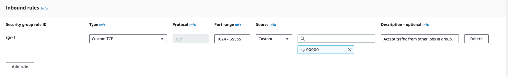
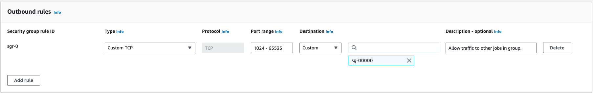

```{r, include = FALSE}
knitr::opts_chunk$set(
  eval = FALSE,
  collapse = TRUE,
  comment = "#>",
  fig.path = "man/figures/README-",
  out.width = "100%"
)
```

# crew.aws.batch: a crew launcher plugin for AWS Batch 

<!--[](https://CRAN.R-project.org/package=crew.aws.batch)-->
[](https://www.repostatus.org/#Active)
[](https://github.com/wlandau/crew.aws.batch/actions?query=workflow%3Acheck)
[](https://app.codecov.io/gh/wlandau/crew.aws.batch)
[](https://github.com/wlandau/crew.aws.batch/actions?query=workflow%3Alint)

In computationally demanding analysis projects, statisticians and data scientists asynchronously deploy long-running tasks to distributed systems, ranging from traditional clusters to cloud services. The `crew.aws.batch` package extends the [`mirai`](https://github.com/shikokuchuo/mirai)-powered 'crew' package with a worker launcher plugin for [AWS Batch](https://aws.amazon.com/batch/). Inspiration also comes from packages [`mirai`](https://github.com/shikokuchuo/mirai), [`future`](https://future.futureverse.org/), [`rrq`](https://mrc-ide.github.io/rrq/), [`clustermq`](https://mschubert.github.io/clustermq/), and [`batchtools`](https://mllg.github.io/batchtools/).

# Installation

Type | Source | Command
---|---|---
Release | CRAN | `install.packages("crew.aws.batch")`
Development | GitHub | `remotes::install_github("wlandau/crew.aws.batch")`
Development | R-universe | `install.packages("crew.aws.batch", repos = "https://wlandau.r-universe.dev")`

# Documentation

Please see <https://wlandau.github.io/crew.aws.batch/> for documentation, including a full function reference and usage tutorial.

# Prerequisites

`crew.aws.batch` launches [AWS Batch](https://aws.amazon.com/batch/) jobs to run [`crew`](https://wlandau.github.io/crew/) workers. This comes with a set of special requirements:

1. Understand [AWS Batch](https://aws.amazon.com/batch/) and its [official documentation](https://aws.amazon.com/batch/).
2. Your [job definitions](https://docs.aws.amazon.com/batch/latest/userguide/job_definitions.html) must each have [Docker](https://www.docker.com/)-compatible container image with R and `crew.aws.batch` installed. You may wish to inherit from an existing [rocker](https://github.com/rocker-org/rocker-versioned2) image.
3. In the [compute environment](https://docs.aws.amazon.com/batch/latest/userguide/compute_environments.html), the [security group](https://docs.aws.amazon.com/vpc/latest/userguide/security-groups.html) must permit all inbound and outbound TCP traffic within itself.^[If you already know the TCP port you will supply to `port` argument of `crew_controller_aws_batch()`, you can restrict the port range to only use that port number.] The controller and the workers must run in this security group so they can communicate within the firewalled local network.^[Please read about the [risks](https://wlandau.github.io/crew/articles/risks.html) and keep TLS encryption turned on (default: `tls = crew_tls(mode = "automatic")`). Please understand and comply with all the security policies of your organization.] If your security group ID is `sg-00000` and belongs to [VPC](https://aws.amazon.com/vpc/) `vpc-00000`, then your inbound and outbound rules may look something like this:





```{r}
client <- paws.compute::ec2()
groups <- client$describe_security_groups(GroupIds = "sg-00000")
str(groups$SecurityGroups[[1L]])
#> List of 8
#>  $ Description        : chr "Allow TCP traffic on ephemeral ports"
#>  $ GroupName          : chr "self-pointing-group"
#>  $ IpPermissions      :List of 1
#>   ..$ :List of 7
#>   .. ..$ FromPort        : num 1024
#>   .. ..$ IpProtocol      : chr "tcp"
#>   .. ..$ IpRanges        : list()
#>   .. ..$ Ipv6Ranges      : list()
#>   .. ..$ PrefixListIds   : list()
#>   .. ..$ ToPort          : num 65535
#>   .. ..$ UserIdGroupPairs:List of 1
#>   .. .. ..$ :List of 7
#>   .. .. .. ..$ Description           : chr "Accept traffic from other jobs in group."
#>   .. .. .. ..$ GroupId               : chr "sg-00000"
#>   .. .. .. ..$ GroupName             : chr(0)
#>   .. .. .. ..$ PeeringStatus         : chr(0)
#>   .. .. .. ..$ UserId                : chr "CENSORED"
#>   .. .. .. ..$ VpcId                 : chr(0)
#>   .. .. .. ..$ VpcPeeringConnectionId: chr(0)
#>  $ OwnerId            : chr "CENSORED"
#>  $ GroupId            : chr "sg-00000"
#>  $ IpPermissionsEgress:List of 1
#>   ..$ :List of 7
#>   .. ..$ FromPort        : num 1024
#>   .. ..$ IpProtocol      : chr "tcp"
#>   .. ..$ IpRanges        : list()
#>   .. ..$ Ipv6Ranges      : list()
#>   .. ..$ PrefixListIds   : list()
#>   .. ..$ ToPort          : num 65535
#>   .. ..$ UserIdGroupPairs:List of 1
#>   .. .. ..$ :List of 7
#>   .. .. .. ..$ Description           : chr "Allow traffic to other jobs in group."
#>   .. .. .. ..$ GroupId               : chr "sg-00000"
#>   .. .. .. ..$ GroupName             : chr(0)
#>   .. .. .. ..$ PeeringStatus         : chr(0)
#>   .. .. .. ..$ UserId                : chr "CENSORED"
#>   .. .. .. ..$ VpcId                 : chr(0)
#>   .. .. .. ..$ VpcPeeringConnectionId: chr(0)
#>  $ Tags               : list()
#>  $ VpcId              : chr "vpc-00000"
```

# Job definition management

You will most likely need to create custom job definitions for your use case. Typically this involves choosing a container image in [AWS Elastic Container Registry (ECR)](https://docs.aws.amazon.com/AmazonECR/latest/userguide/getting-started-cli.html) and specifying the resource requirements of jobs. AWS has documentation for  The `paws.compute` package makes it straightforward to manage job definitions. Please see the AWS Batch functions at <https://www.paws-r-sdk.com/docs/reference_index/> to register, describe, and deregister job definitions. To see how ECR image URLs work, visit <https://docs.aws.amazon.com/AmazonECR/latest/userguide/getting-started-cli.html>.

To ["register" (create or overwrite) a job definition](https://www.paws-r-sdk.com/docs/batch_register_job_definition/), use the R code below and replace the values with the ones you want.

```{r}
client <- paws.compute::batch()
client$register_job_definition(
  jobDefinitionName = "JOB_DEFINITION_NAME",
  type = "container",
  containerProperties = list(
    image = "AWS_ACCOUNT_ID.dkr.ecr.AWS_REGION.amazonaws.com/ECR_REPOSITORY_NAME:IMAGE_TAG",
    vcpus = 2,
    memory = 4000
  )
)
```

To collect information about existing job definitions, you can either ask for all job definitions,

```{r}
client$describe_job_definitions()
```

or just the a specific version of a specific job definition.

```{r}
client$describe_job_definitions("JOB_DEFINITION_NAME:1")
```

To delete a job definition, specify the name and version of the job definition (or the full [Amazon Resource Name](https://docs.aws.amazon.com/IAM/latest/UserGuide/reference-arns.html), or ARN).

```{r}
client$deregister_job_definitions("JOB_DEFINITION_NAME:1")
```

# Package usage

To start using `crew.aws.batch`, first create a controller object. Also supply the names of your job queue and job definition, as well as any optional flags and settings you may need.

```{r}
library(crew.aws.batch)
controller <- crew_controller_aws_batch(
  name = "my_workflow", # for informative job names
  workers = 16,
  tasks_max = 2, # to avoid reaching wall time limits
  seconds_launch = 600, # to allow a 10-minute startup window
  seconds_idle = 60, # to release resources when they are not needed
  processes = NULL, # See the "Asynchronous worker management" section below.
  aws_batch_job_definition = "YOUR_JOB_DEFINITION_NAME",
  aws_batch_job_queue = "YOUR_JOB_QUEUE_NAME"
)
controller$start()
```

At this point, usage is exactly the same as basic [`crew`](https://wlandau.github.io/crew). The `push()` method submits tasks and auto-scales [AWS Batch](https://aws.amazon.com/batch/) workers to meet demand.

```{r}
controller$push(name = "do work", command = do_work())
```

The `pop()` method retrieves available tasks.

```{r}
controller$pop()
#> # A tibble: 1 × 11
#>   name         command result seconds   seed error trace warni…¹ launc…² worker insta…³
#>   <chr>        <chr>   <list>   <dbl>  <int> <chr> <chr> <chr>   <chr>    <int> <chr>  
#> 1 do work   … do_work… <int>        0 1.56e8 NA    NA    NA      79e71c…      1 7686b2…
#> # … with abbreviated variable names ¹​warnings, ²​launcher, ³​instance
```

Remember to terminate the controller when you are done.

```{r}
controller$terminate()
```

# Asynchronous worker management

HTTP requests to submit and terminate jobs may take up to 1 or 2 seconds, and this overhead may be burdensome if there are many workers. To run these requests asynchronously, set the `processes` argument of `crew_controller_aws_batch()` to the number of local `mirai` daemons you want to process the requests. These processes will start on `controller$start()` and end on `controller$terminate()` or when your local R session ends. `controller$launcher$async$errors()` shows the most recent error messages generated on launch or termination for all workers.

# Troubleshooting

`processes = NULL` disables async and makes launch/termination errors immediate and easier to see. You may also wish to set `options(paws.log_level = 3L)` to increase the verbosity of `paws` messages.

# Thanks

* [Charlie Gao](https://github.com/shikokuchuo) created [`mirai`](https://github.com/shikokuchuo/mirai) and [`nanonext`](https://github.com/shikokuchuo/nanonext) and graciously accommodated the complicated and demanding feature requests that made `crew` and its ecosystem possible.
* Thanks to [Henrik Bengtsson](https://github.com/HenrikBengtsson), [David Kretch](https://github.com/davidkretch), [Adam Banker](https://github.com/adambanker), and [Michael Schubert](https://github.com/mschubert) for edifying conversations about cloud computing in R.

# Code of Conduct

Please note that the `crew` project is released with a [Contributor Code of Conduct](https://github.com/wlandau/crew/blob/main/CODE_OF_CONDUCT.md). By contributing to this project, you agree to abide by its terms.

# Citation

```{r eval = TRUE, warning = FALSE, comment = ""}
citation("crew.aws.batch")
```
